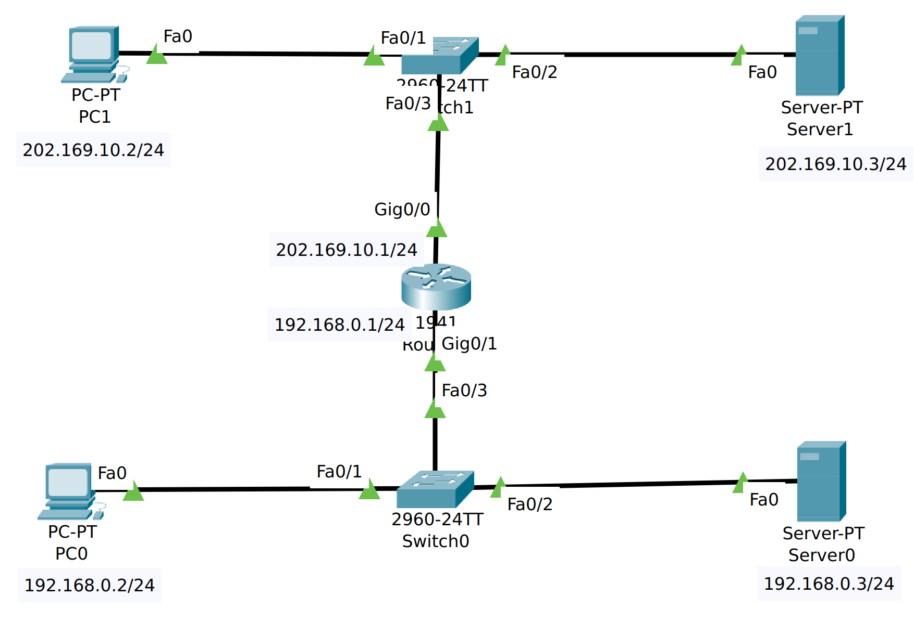
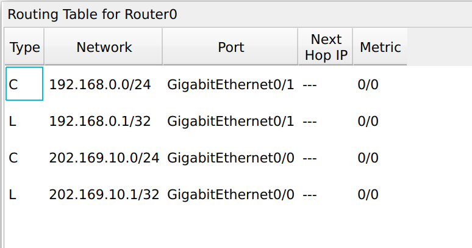
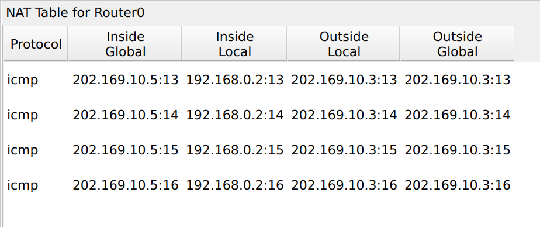

### NAT

NAT即Network Access Translator，目的是建立私有网络和公网的映射，一反面减少公网IP的使用，另一方面对外隐藏内部网络结构，对内网主机而言具有一定安全性。

### 1）网络拓扑：



### 2）初始路由表:



在 **路由器配置** 中，`C` 和 `L` 类型表示的是不同类型的接口或网络配置。让我们逐一分析你提到的内容：

##### 1. **C 类型 (Connected Network)**
- **C 类型**代表的是**连接的网络**（**Connected Network**）。这意味着路由器接口连接到该网络，并且路由器自动识别到该网络的存在。
- 在路由器中，`C` 类型用于标记已直接连接到路由器接口的网络。例如，假设路由器的接口配置了 IP 地址 `192.168.0.1/24`，且路由器连接到一个名为 **192.168.0.0/24** 的网络，`C` 类型表示路由器接口与此网络相连。

  **例子：**
  ```
  C 192.168.0.0/24 is directly connected, Ethernet0
  ```
  这表示路由器的 `Ethernet0` 接口连接到网络 `192.168.0.0/24`，即该接口在该网络上有一个 IP 地址，并且路由器能够自动识别到这个网络。

##### 2. **L 类型 (Local Network)**
- **L 类型**代表的是**本地网络**（**Local Network**）。L 类型用于标记路由器上的特定接口的 IP 地址，而该接口的 IP 地址是指向**单个设备的**（通常是接口本身），而不是一个整个的网络。 
- 这个 `L` 类型通常表示的是路由器接口的 **本地地址**，即路由器上的接口 IP 地址。

  **例子：**
  ```
  L 192.168.0.1/32 is directly connected, Ethernet0
  ```
  这意味着路由器的接口 `Ethernet0` 上的 IP 地址是 `192.168.0.1`，并且这是一个 **/32** 网络，表示该地址仅适用于该接口本身。

##### 3. **`192.168.0.0/24` 和 `192.168.0.1/32`**
- **`192.168.0.0/24`**：这个网络表示的是 **整个子网**，也就是从 `192.168.0.0` 到 `192.168.0.255` 的所有 IP 地址（总共 256 个地址）。`/24` 表示子网掩码为 `255.255.255.0`，即网络部分占 24 位，剩下的 8 位用来表示主机地址。在路由器的上下文中，`C` 类型的网络意味着该网络已经连接到路由器的某个接口。
  
  - **表示该网络**：`192.168.0.0/24` 就是一个包含所有设备的子网，其中第一个地址（`192.168.0.0`）是网络地址，最后一个地址（`192.168.0.255`）是广播地址，其他地址（`192.168.0.1` 到 `192.168.0.254`）可用于主机。

- **`192.168.0.1/32`**：这个表示的是 **单个 IP 地址**，而不是一个网络。`/32` 是子网掩码表示法，表示所有 32 位都用于指定地址，即指向 **某个特定设备**（在这里就是路由器接口的 IP 地址）。`192.168.0.1/32` 实际上意味着 **只表示 `192.168.0.1` 这个地址**，并且该地址通常用于标识路由器接口本身。

  - **为什么会有 `192.168.0.1/32`？**
    - 在路由器中，`/32` 表示的是**单个地址**，常常用于描述路由器本身的接口地址。它不会表示网络范围，只表示一个特定的设备。比如，路由器接口的 IP 地址是 `192.168.0.1`，那么这个地址就被表示为 `192.168.0.1/32`，用于标识接口本身。
    - 如果这个接口的地址 `192.168.0.1` 是用于静态路由或路由表中某条特定的路径，使用 `/32` 可以明确表示这是单一地址而非网络范围。

##### 4. **总结：**
- **C 类型** (`192.168.0.0/24`) 表示 **已连接的网络**，即路由器接口连接到的整个网络。
- **L 类型** (`192.168.0.1/32`) 表示路由器接口的 **本地地址**，即路由器本身的接口地址。
- **`/32` 子网掩码**：表示单一地址，用于标识特定设备的地址，而不是一个网络。

在 **路由器配置** 中，`C` 类型是网络连接的标识，`L` 类型是接口本身的标识，而 `/32` 用于指代单个 IP 地址（通常是路由器的接口地址）。


**思考题：**请思考，此时为什么在路由器上能ping通PC0和Server1，但是PC0却ping不通Server1

答：因为路由器连接的是两个网络，他有两个端口，分别对应两个网络，因此ping不同网络中的设备是可以的。

但是由于PC0和Server1处于不同网络，同时没有设置路由器NAT，因此ping失败。

### 3）静态NAT映射（Static NAT）

```javascript
Router>enable
Router#config terminal
Enter configuration commands, one per line.  End with CNTL/Z.

Router(config)#interface g0/0
Router(config-if)#ip nat outside  // 将端口G0/0设置为外网出口模式
Router(config-if)#exit

Router(config)#interface g0/1
Router(config-if)#ip nat inside  // 将端口G0/1设置为内网入口模式
Router(config-if)#exit

Router(config)#ip nat inside source static 192.168.0.2 202.169.10.1  // 配置静态NAT
Router(config)#exit

Router#show ip nat translations
Pro  Inside global     Inside local       Outside local      Outside global
---  202.169.10.1      192.168.0.2        ---                ---
```

**NAT地址表解释**

NAT转换表内容依次为：Pro（协议类型）、Inside global（内部全局地址及端口）、Inside local（内部本地地址及端口）、Outside local（外部本地地址及端口）、Outside global（外部全局地址及端口）。

通常来说，内部是机构网络（如校园网、私人企业等），外部是公共互联网。本地地址是内部设备可以看到的地址，全局地址是外部设备可以看到的地址。

1. **Inside global（内部全局地址）** 是外部已知内部设备的一个合法的IP地址，它对外代表一个或多个内部本地IP地址。
2. **Inside local（内部本地地址）** 分配给内部网络中的计算机的内部私有IP地址。
3. **Outside local（外部本地地址）** 是内部已知外部设备的地址，即外部主机在内部网络中表现出来的IP地址。
4. **Outside global（外部全局地址）** 分配给外部网络上的主机分配的IP地址。

**结果：**PC0 ping Server1 success，Server0 ping Server1 fail. 

**注意：**PC0和Server0需要设置默认网关，否则ping的时候出现

""

   ...

5. The destination IP address 202.169.10.2 is not in the same subnet and is not the broadcast address.
6. The default gateway is not set. The device drops the packet.

""

另做实验，PC1和Server1也配置默认网关的时候，尽管route NAT表中没有Server0的地址转换项，Server0 ping PC1或Server1也是成功的。

当清除路由中配置的NAT映射时，PC0 ping PC1或者Server1均成功。观察数据包可知，经过路由时，地址没有被映射。

### 4）动态NAT（Pooled NAT）

路由配置：

```javascript
Router(config)#access-list 1 permit 192.168.0.0 0.0.0.255  // 创建访问控制列表1，允许来自192.168.0.0网段的数据访问
Router(config)#ip nat pool aaa 202.169.10.5 202.169.10.10 netmask 255.255.255.0  // 配置nat地址池为202.169.10.5 到202.169.10.10
Router(config)#ip nat inside source list 1 pool aaa  // 在接口内应用nat转换
```

当PC0 ping Server1时，路由器的NAT表变成如下：

ping了四次嘛，故有四项



### 5）NAT端口复用（Network Address and Port Translation）

路由设置：

```javascript
Router(config)#access-list 1 permit 192.168.0.0 0.0.0.255
Router(config)#ip nat inside source list 1 interface g0/0 overload  // 将access-list 1映射到公网地址g0/0网卡上
```

PC0 ping Server1成功，路由NAT表：

```javascript
Router#show ip nat translations
Pro  Inside global     Inside local       Outside local      Outside global
icmp 202.169.10.1:17   192.168.0.2:17     202.169.10.3:17    202.169.10.3:17
icmp 202.169.10.1:18   192.168.0.2:18     202.169.10.3:18    202.169.10.3:18
icmp 202.169.10.1:19   192.168.0.2:19     202.169.10.3:19    202.169.10.3:19
icmp 202.169.10.1:20   192.168.0.2:20     202.169.10.3:20    202.169.10.3:20
```

可以发现与动态NAT的不同在于Inside global 的IP永远是路由器出口地址，变化的是端口

请思考，Router0如何区分Server1返回给不同主机的报文？

根据端口的不同。

### 6）配置NAT Server

即外网访问内网的服务器。

```javascript
Router(config)#no access-list 1 permit 192.168.0.0 0.0.0.255  // 取消访问控制列表1
Router(config)#no ip nat inside source list 1 interface g0/0 overload  // 取消access-list 1的映射

// 将公网地址202.169.10.1的21号端口映射到Server0上
Router(config)#ip nat inside source static tcp 192.168.0.3 21 202.169.10.1 21
Router(config)#exit

Router#show ip nat translations
Pro  Inside global     Inside local       Outside local      Outside global
tcp 202.169.10.1:21    192.168.0.3:21     ---                ---
```

这时，PC0 ping 不通外网，Server0也 ping 不通。这是由于，数据包通过默认网关发送至外网，被目标IP设备接收，该设备响应ICMP请求，打包响应数据包，但是发现源IP与自己不是一个网段，且未设置默认网关，这种情况下，丢弃该响应。发送端超时，ping 请求失败。

请思考，NAT Server和静态NAT这两种技术的区别是什么？

答：静态NAT只允许内网访问外网，而NAT Server允许外网访问内网上的设备，比如服务器。

