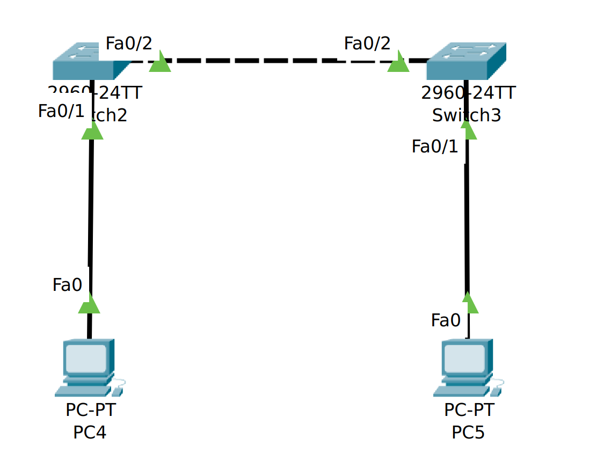

#### 场景1

1. Settings

​	Switch2 Fa0/2 and Switch3 Fa0/2 is trunk mode, allowed vlan is 2 and 3

​	Switch2 Fa0/1 and Switch3 Fa0/1 is access mode, the according vlan is 2 and 3

2. Experiment

​	PC4 ping PC5 **failed**

3) Analysis

   PC4 发送**未标记**数据包至Switch2的Fa0/1端口，交换机给该数据包打标记VLAN为2，通过端口Fa0/2发出去；

   Switch3的Fa0/2接收该数据包，但是不会发送，因为其端口Fa0/1只发送VLAN为3的数据包

   #### 场景2

   下图中Switch0的Fa0/1和Fa0/4属于同一个VLAN 2，Switch1的Fa0/1和Fa0/4属于同一个VLAN 3，这四个端口都是access口，试验结果PC0和PC1能互通，请问属于不同VLAN中的PC0和PC1为什么也能通？

   

   答：交换机转发的报文是EthernetII，不带有tag标记，又由于PC0和PC1是同一个子网，存在物理连接关系，因此可以ping通。

   问：当把Switch0的Fa0/4和Switch1的Fa0/4改成trunk模式（其pvid==1，默认值）反而不通？

   答：当PC0 ping PC1时，首先创建ICMP数据报，ICMP进程发现MAC地址未知，又启动ARP进程，ARP进程创建ARP数据报，PC0的ARP数据报发送至Switch0，经过Switch0的转发，该报文带有VID==2的标识，是Ethernet802.1Q协议，该报文被发送至Switch1，Switch1检查其VLAN允许列表，发现只有1（默认）和3，不包含2，因此丢弃该数据报。

   PC0端的ICMP进程收不到ARP进程的响应，设置超时时间达到，因此ping请求失败。

   

   

   