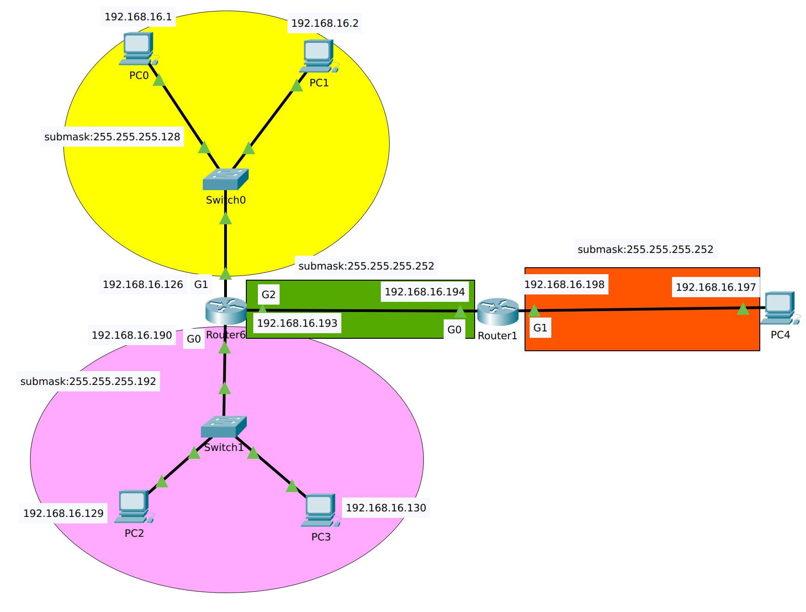
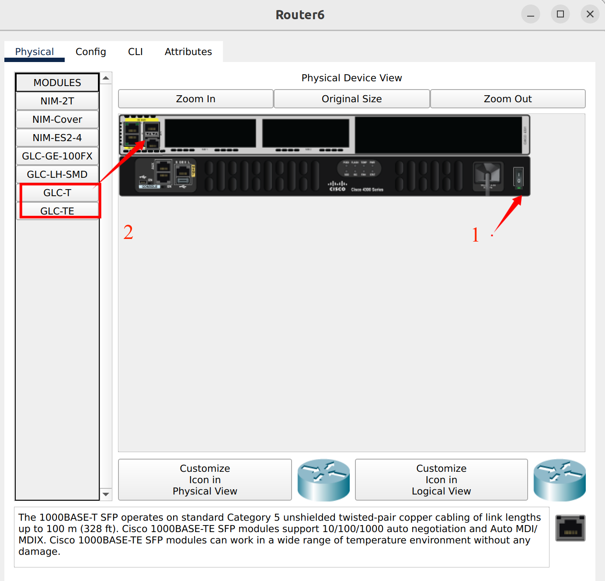
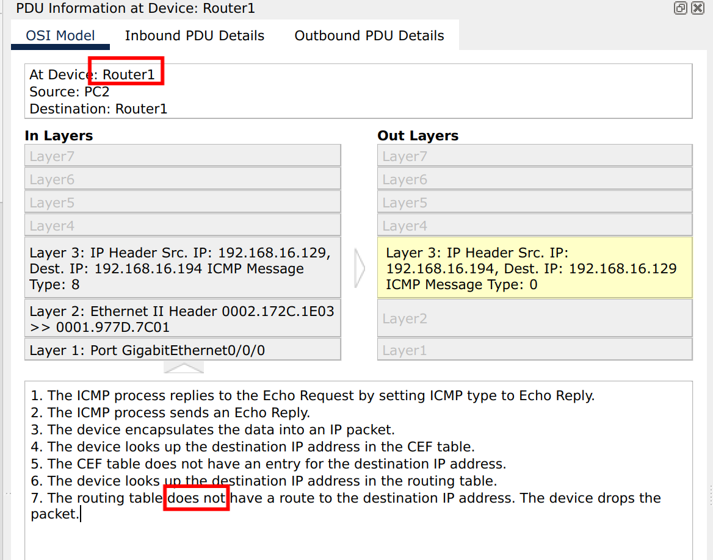
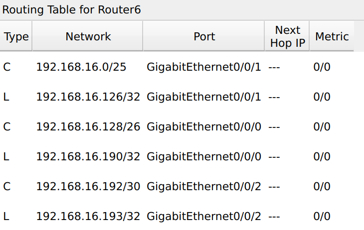
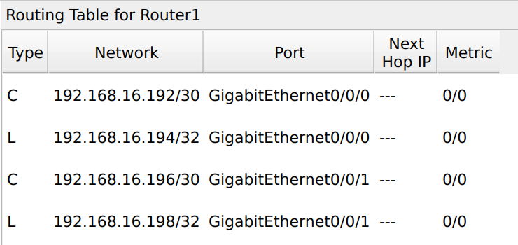
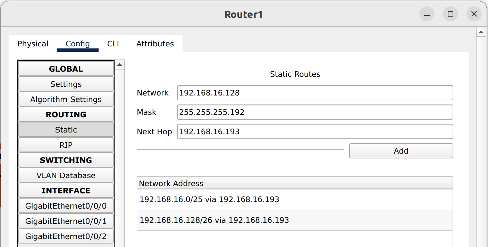
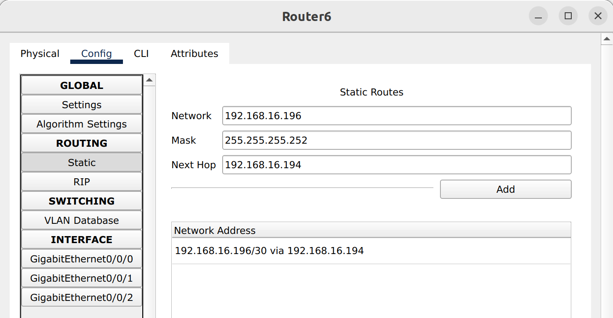
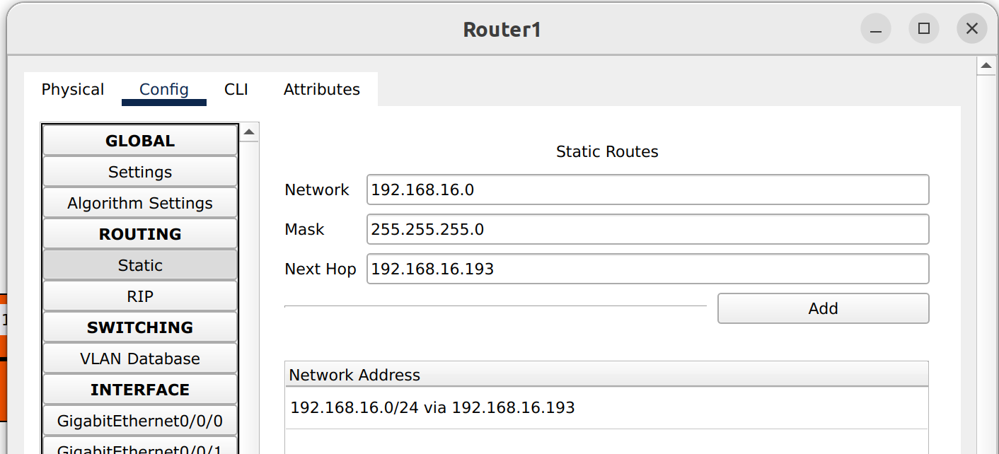

# Variable Length Subnet Mask

如上图所示，一共有四个网络，分别是黄色的192.168.16.0/25，粉红色的192.168.16.128/26，绿色的192.168.16.192/30以及橙色的192.168.16.196.30.

#### 下面分别计算每一个网络所有子网的网络地址、广播地址、地址范围、子网掩码。

1、黄色的192.168.16.0/25

因为网络位向主机位借一位，那么子网的个数就是2。主机位为7。

| 项               | 子网1            | 子网2              |
| ---------------- | ---------------- | ------------------ |
| 网络地址         | 192.168.16.0     | 192.168.16.128     |
| 广播地址         | 192.168.0.127    | 192.168.16.255     |
| 地址范围         | 192.168.16.1-126 | 192.168.16.129-254 |
| 子网掩码（一致） | 255.255.255.128  | 255.255.255.128    |
| 主机数量（一致） | 126              | 126                |

2、紫色的192.168.16.128/26

因为网络位向主机位借两位，那么子网的个数就是4。主机位为6。

| 项               | 子网1           | 子网2             | 子网3              | 子网4              |
| ---------------- | --------------- | ----------------- | ------------------ | ------------------ |
| 网络地址         | 192.168.16.0    | 192.168.16.64     | 192.168.16.128     | 192.168.16.192     |
| 广播地址         | 192.168.16.63   | 192.168.16.127    | 192.168.16.191     | 192.168.16.255     |
| 地址范围         | 192.168.16.1-62 | 192.168.16.65-126 | 192.168.16.129-190 | 192.168.16.193-254 |
| 子网掩码（一致） | 255.255.255.192 | 255.255.255.192   | 255.255.255.192    | 255.255.255.192    |
| 主机数量（一致） | 62              | 62                | 62                 | 62                 |

3、绿色和橙色属于同一个网络下的不同子网

192.168.16.192.30.和192.168.16.196.30，网络位向主机位借6位，表示有64个子网，主机位为2。

| 项               | 子网1           | ...  | 子网49             | 子网50             | ...  | 子网64          |
| ---------------- | --------------- | ---- | ------------------ | ------------------ | ---- | --------------- |
| 网络地址         | 192.168.16.0    |      | 192.168.16.192     | 192.168.16.196     |      | 192.168.16.252  |
| 广播地址         | 192.168.16.3    |      | 192.168.16.195     | 192.168.16.199     |      | 192.168.16.255  |
| 地址范围         | 192.168.1-2     |      | 192.168.16.193-194 | 192.168.16.197-198 |      | 192.168.253-254 |
| 子网掩码（一致） | 255.255.255.252 |      | 255.255.255.252    | 255.255.255.252    |      | 255.255.255.252 |
| 主机数量（一致） | 2               |      | 2                  | 2                  |      | 2               |

#### 网络拓扑图的搭建以及设备IP的配置

图中Route6型号为ISR4331（Integrated Services Router，ISR），由于Cisco packet tracer有bug，需要增添一个端口。

具体操作过程如下：打开路由器物理设置，首先按照图中所示1关闭电源；然后选择红框中的GLC-T或者GLC-TE放置到箭头所指位置；打开电源。

分别按照网络拓扑图中的信息，配置设备的IP和子网掩码，注意PC需要配置网关。

**1）成功互联：**

这时黄色网络中PC0、PC1、Router6的G1端口可以互ping成功；

粉红色网络中的PC2、PC3、Router6的G0端口可以互ping成功；

绿色网络中Router6的G2端口和Router1的G0端口可以互ping成功；

橙色网络中PC4和Router的G1端口可以互ping成功。

PC2与PC0、PC1可以互联，PC3同理，PC0、PC1同理。

**2）没有互联的情况：**

PC2 ping Router1的G0端口**失败**，这是由于报文发送至Router1，它构建响应报文，但是，Router1知道的网络只有绿色和橙色的，它不知道IP:192.168.16.129所在网络的信息，不知道数据报该向哪里转发，所以丢弃数据报。

其中，CEF是Cisco Express Forwarding的意思。

Router6的路由表：

Router1的路由表：

由此可知，Router1不知道黄色网络和粉红色网络的存在，因此丢弃ICMP响应报文。同理Router6不知道橙色网络的存在，PC2 ping PC4显示"Reply from 192.168.16.190: Destination host unreachable."，即Router6显示目的主机不可达，因为它不知道要把数据报转发到哪里去。

#### 静态路由

通过设置静态路由，告知Router6橙色网络的存在，以及下一跳（即将数据报转发给谁），同理告知Router1黄色和粉红色网络的存在以及设置下一跳。

通过设置静态路由，PC2和PC4就可以通信了。

#### 路由聚合

Router1中的两条记录可以合并，合并规则查找路由记录的最长公共子串，针对记录192.168.16.0/25和192.168.16.128/26，我们发现其最长公共子串为192.168.16.0/24，因此将这两条记录合并为一条。

